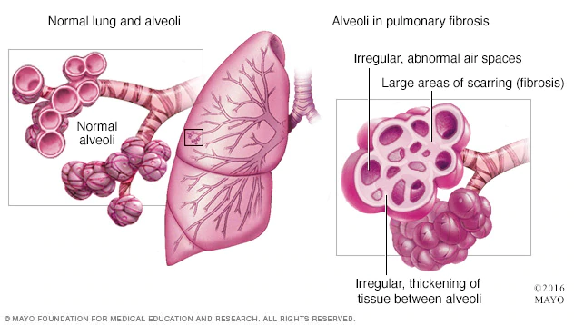
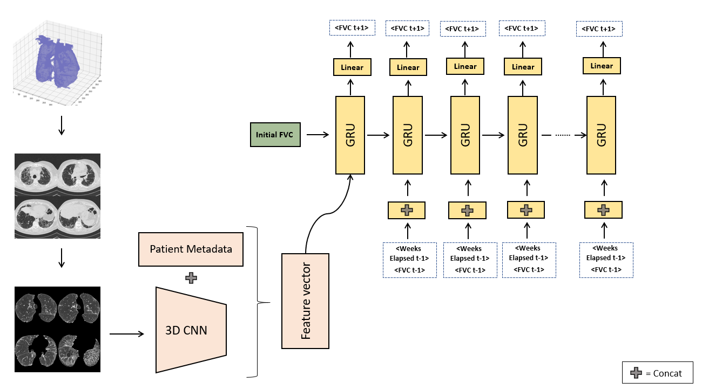

# Pulmonar_Fibrosis_Progression

## Introduction

**Fibrotic lung diseases** are an open and difficult problem nowadays, due to its variety and severity. Current methos make fibrotic lung diseases difficult to treat, even with access to a chest CT scan. Fibrotic lungs affect patients capabilty to breath correctly and in several cases this decline is fast and agressive.

This project tries to predict the severity of decline in lung function based on a CT scan of patients lungs. Breathing capacity can be measured with a spirometer, which measures the volume of air inhaled and exhaled.

The challenge is to make predictions over the time with the CT_Scans images, metadata, and baseline FVC as input. If successful, patients and their families would better understand their prognosis when they are first diagnosed with this **incurable lung disease**. Improved severity detection would also positively impact treatment trial design and accelerate the clinical development of novel treatments.

The fibrosis can be observed as scars over the lungs. This gif reflects a CT Scan with severe fibrosis

## Installation

The code is based on Jupyter notebook Framework, using Python code. The main library used is Tensorflow 2.3 but any 2.x should be supported, as well you will need libraries like Pandas, Numpy, Pydicom (in order to read dicom CT Scans), Sciypy, Glob, skimage and OpenCV to perform Images Transformations. If you want to be fast and perform preprocessing images in paralell optionally you can install [Joblib](https://joblib.readthedocs.io/en/latest/). 

There are few GPU commands in order to manage the memmory, in case you dont have a GPU just comment them or run it on [Google Colab](https://colab.research.google.com/) with freee GPU, and in case you want to run it on your local machine with GPU you will need to install tf-nightly.

`pip install --upgrade tensorflow` 
`pip install --upgrade tf-nightly`

In order to reproduce the results, follow these steps:

 1. Obtain the Data (Check Data Paragraph below). 
 
 2. Upload the notebooks to your local machine or Google Colab workspace. I recommend keep the default values of paths variables but you can modigy them if you desire.
 
 3. Running Scripts
     1. Run `01_Preprocess_CT_Scans.ipynb`, in order to get the masks images and save them as `.npy` files. 
     2. Run `02_Preprocess_CorruptedImages.ipynb` **only** in case you had issues with 2 patients that have corrupted images.
     3. Run `03_Autoencoder_Unet3D.ipynb` for training the 3D Scans feature extractor Autoencoder. Its a mid-simple autoencoder model that will accelerate training on the final model. You can acces the pretrained model on `Saved_models`
     4. **Optional.** Run `Optional_Resnet3D.ipynb` , didn´t outperform autoencoder in my tests but maybe you make it works.
     5. Run `04_FullModelTraining.ipynb` for Sequence to Sequence Model training, at least you will need utils scripts and masked scans. Standard params are provided you can tune them as you wish, maybe some combination does not works, i am testing several combinations and solving bugs. Code will be updated.
 
 ## Data
 
1. The Data Zip File size is about 20GB, so be sure you have enough space before unzipping.
2. The Dataset consists on 2 folders (train/ & test/), in which you will find a unique folder for each patient CT-Scan, The test patients are a subset of train patients. Besides there are a train.csv and test.csv files containing the patients metadata and the FVC measures along the weeks the patient visited the doctor.

If you want acces to the data you will have to mail <enric.rovira96@gmail.com> and attach an axplanation about how are going to use the data.

Extact the contents of the zip file into your local machine or [Google Colab](https://colab.research.google.com/)

#### Dataset preprocessing

Patient metadata consists on these features:
 - Patient Age.
 - Patient Sex.
 - Patient Smoke Status (Ex-Smoker, smoker, Never smoked).
 - Weeks elapsed since last visit.
 - FVC forced vital capacity, volume of air exhaled measured with a spirometer and represented in ml.
 - Percent, a computed field which approximates the patient's FVC as a percent of the typical FVC for a person of similar characteristics.

We convert the raw tabular dataset to a Sequence dataset, by the key [Patient+Week], and create dictionaries with inital features and sequence features that will serve as encoder and decoder inputs on the Model Stage.

We perform StandarScaling over continous features such as Patient Age, FVC and Percent

We will feed these preprocessed features in `tf.keras.utils.Sequence` API, as our Data Generator.

 ## Model
 
 
 
 ## Results & Metrics
 
 ## Conclusions & Further Steps

