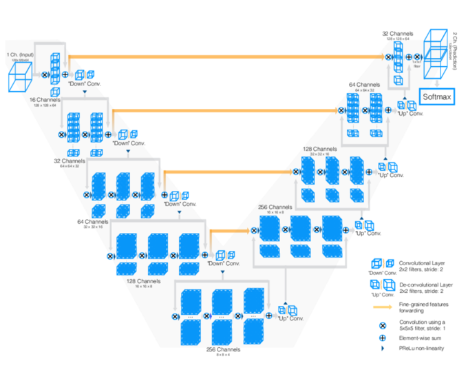

# Pulmonar_Fibrosis_Progression

Sequence to Sequence Model based on encoder decoder architecture wirth visual attention for predictiong the progression of the Pulmonar Firbrosis in a wide range of weeks.

## Introduction

**Fibrotic lung diseases** are an open and difficult problem nowadays, due to its variety and severity. Current methos make fibrotic lung diseases difficult to treat, even with access to a chest CT scan. Fibrotic lungs affect patients capabilty to breath correctly and in several cases this decline is fast and agressive.

This project tries to predict the severity of decline in lung function based on a CT scan of patients lungs. Breathing capacity can be measured with a spirometer, which measures the volume of air inhaled and exhaled.

The challenge is to make predictions over the time with the CT_Scans images, metadata, and baseline FVC as input. If successful, patients and their families would better understand their prognosis when they are first diagnosed with this **incurable lung disease**. Improved severity detection would also positively impact treatment trial design and accelerate the clinical development of novel treatments.

The fibrosis can be observed as scars over the lungs. This gif reflects a CT Scan with severe fibrosis

## Installation

The code is based on Jupyter notebook Framework, using Python code. The main library used is Tensorflow 2.3 but any 2.x should be supported, as well you will need libraries like Pandas, Numpy, Pydicom (in order to read dicom CT Scans), Sciypy, Glob, skimage and OpenCV to perform Images Transformations. If you want to be fast and perform preprocessing images in paralell optionally you can install [Joblib](https://joblib.readthedocs.io/en/latest/). 

There are few GPU commands in order to manage the memmory, in case you dont have a GPU just comment them or run it on [Google Colab](https://colab.research.google.com/) with freee GPU, and in case you want to run it on your local machine with GPU you will need to install tf-nightly.

`pip install --upgrade tensorflow` 
`pip install --upgrade tf-nightly` 
`pip install --upgrade tensorflow-probability` 
`pip install --upgrade streamlit`

In order to reproduce the results, follow these steps:

 1. Obtain the Data (Check Data Paragraph below). 
 
 2. Upload the notebooks to your local machine or Google Colab workspace. I recommend keep the default values of paths variables but you can modigy them if you desire.
 
 3. Running Scripts
     1. Run `01_Preprocess_CT_Scans.ipynb`, in order to get the masks images and save them as `.npy` files. 
     2. Run `02_Preprocess_CorruptedImages.ipynb` **only** in case you had issues with 2 patients that have corrupted images.
     3. Run `03_Autoencoder_Unet3D.ipynb` for training the 3D Scans feature extractor Autoencoder. Its a mid-simple autoencoder model that will accelerate training on the final model. You can acces the pretrained model on `Saved_models`
     4. **Optional.** Run `Optional_Resnet3D.ipynb` , didn´t outperform autoencoder in my tests but maybe you make it works.
     5. Run `04_FullModelTraining.ipynb` for Sequence to Sequence Model training, at least you will need utils scripts and masked scans. Standard params are provided you can tune them as you wish, maybe some combination does not works, i am testing several combinations and solving bugs. Code will be updated.
     6. **Optional.** Run `Optional_PlotScans.ipynb` , to plot 3d lungs with segmentations and different window values.
     7. Run `streamlit run 06_Dashboard` inside Dashboard folder to run a streamlit dashboard
 
 ## Data
 
1. The Data Zip File size is about 20GB, so be sure you have enough space before unzipping.
2. The Dataset consists on 2 folders (train/ & test/), in which you will find a unique folder for each patient CT-Scan, The test patients are a subset of train patients. Besides there are a train.csv and test.csv files containing the patients metadata and the FVC measures along the weeks the patient visited the doctor.

If you want acces to the data you will have to mail <enric.rovira96@gmail.com> and attach an axplanation about how are going to use the data.

Extact the contents of the zip file into your local machine or [Google Colab](https://colab.research.google.com/)

#### Dataset preprocessing

Patient metadata consists on these features:
 - Patient Age.
 - Patient Sex.
 - Patient Smoke Status (Ex-Smoker, smoker, Never smoked).
 - Weeks elapsed since last visit.
 - FVC forced vital capacity, volume of air exhaled measured with a spirometer and represented in ml.
 - Percent, a computed field which approximates the patient's FVC as a percent of the typical FVC for a person of similar characteristics.

We convert the raw tabular dataset to a Sequence dataset, by the key [Patient+Week], and create dictionaries with inital features and sequence features that will serve as encoder and decoder inputs on the Model Stage. Finally, we perform StandarScaling over continous features such as Patient Age, FVC and Percent.

We will feed these preprocessed features in `tf.keras.utils.Sequence` API, as our Data Generator.

#### Imgs preprocessing

We convert the Raw images to [Hounsfield units](https://en.wikipedia.org/wiki/Hounsfield_scale) and mask the Lungs and save them in two folders `01_Data/train_masks/` and `01_Data/test_masks/`. This step can be reproduced with `01_Preprocess_CT_Scans.ipynb` notebook.

 ## Models
 
 General Architecture Diagram.
 
 
 
 SubModels:
 
  - **BackBoneTabularModel** This model creates the Embedding layers for processing the Sex and Smoker Status feature and concats the embeddings outputs with age and percent inputs. finally a dense layer is applied to the concatenated vector. With params we can change the embedding sizes, regularitzations, dropouts rates and dense dim.
  
  - **3D Autoencoder** 
   This model receives the 3D Scans as inputs with several Data Augmentations (Flipping, updown, random crop, randomwindow, slicing, inverse order and random rotation) and compresses the image in a latent vector with low dimension (depending on the input). This model is  trained on (32*160*160) Images but any size will be accepted although i do not recommend you.
   
     

  - **Backbone 3D Image Feature**
  This model receives the 3D Scans as inputs with the same Data Augmentations as the Autoencoder model and compresses the image in a latent vector with low dimension (depending on the input). With params we can choose between using the autoencoder features (will speed up training) or extrracting features with several Conv+Pool layers.
  
  - **Encoder**
  This model receives `BackBoneTabularModel` and `Backbone 3D Image Feature` outputs and concatenates them and performs a dense layer over the concatenated vector, dropout is applied before dense, and with params we can manage dropout rates, regularitzations, dense dim (I recommend you keep the dense dimension equal to the decoder input dimension) to avoid paddings... This model will mix the image features and tabular features in a (batch_size, image_dim, encoder_dense_dim).
  
  - **Decoder**
  This model is where the ´magic´ happens. Will learn to map the encopder features along with the sequence inputs(fvc t-1 and weeks elapsed) to make predictions. An attention Layer will map the encoder output vector to a context vector and concatenate it with the the sequence inputs. This vector will pass through a Gru layer/s and finally through a Dense(optional) vector. With params we can manage the regularitzations, attention dim, num and units of gru, num and units of denses, dense activation, and dropouts.  
  
  - **PulmonarFibrosis Sequence**
  This model brings the models mentioned before together and receives several traning params such as teacher forcing, teacher forcing decay, learning rate, checkpoints, sample weights... Provides custom functions to fit, predict and evaluate.
  
 
 ## Results & Metrics
 
 The main problem of this dataset was that 176 really means very low data, and these architectures need a huge amount of data to learn specific patterns taht can generalize well without overfitting, this effect has been reduced thanks to techniques such as data augmentation, very high regularitzation (dropout, weigh decay, kernel_constraints, kernel_recurrent_constraints and clip gradients).
 
 Another important aspect of this project is to keep focus on how we can help medicione in prgonosis and evolution of this desease. This model is able to make strong and far predictions, with high confidence, not only saying if a patient has fibrosis or no or which FVC will have in a couple of weeks, it can forecast long time measures (40 weeks) and long sequences.
 
 #### Metrics 
 
  | MSE   | RMSE |  MAPE | CustomMetric |
  |-------|:----:|:-----:|------:|
  | 13878 | 9.47 | 3.51 | 6.25
  
 #### Baselines 
 
  - Baseline 1- Mean FVC from training to all predictions
  
  | MSE   | RMSE |  MAPE | CustomMetric |
  |-------|:----:|:-----:|------:|
  | 151977 | 14.26 | 12.11 | 9.82
  
  - Baseline 2 - Initial FVC per Patient from each patient we take initial fvc and predict it over all timesteps.
  
  | MSE   | RMSE |  MAPE | CustomMetric |
  |-------|:----:|:-----:|------:|
  | 100013 | 12.98 | 8.22 | 8.92
  
  - Baseline 3 - Last Timestep(Although this is a good baseline for general Sequence-to-Sequence purposes it is not for this case because we want to focus on the prognosis availability of the model).
  
| MSE   | RMSE |  MAPE | CustomMetric |
  |-------|:----:|:-----:|------:|
  | 23886 | 10.13 | 4.25 | 6.83
 
 
 ## Conclusions & Further Steps

There are several things that can be done for improving the model and the baslines availabilty to compare results:

- Increse number of params such as decoder rnn dropout, l2 weight decay alpha, etc.
- Hypertune the model.
- Add early stopping.
- Improve architecture, (more layers/params)
- Improve autoencoder architecture (Huge resources needed).
- Sample weight the last timestep of the sequences more than the earliest.

In general the model is learning good patterns and making good predictions, also we can interpretate the results thanks to attentions and there is room for improvement!!
Any idea/comments will be much appreciated.

